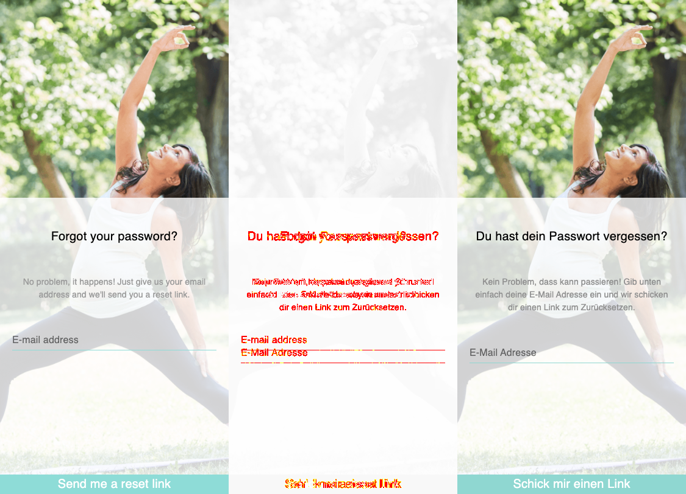

## Web App with RESET-PASSWORD flow
> [React](https://reactjs.org/) and [Typescript](https://www.typescriptlang.org/)


----
### What was done:
- [x] implement responsive design (mobile first) [DEMO https://keleya.netlify.app/](https://keleya.netlify.app/)
- [x] add translation EN/DE
- [x] store email/password in localStorage
- [x] E2E screenshot tests

### Want to change translation manually DE/EN?
- http://localhost:3002/?lng=en
- http://localhost:3002/?lng=de

### Reset password flow
- `$ yarn start`
- Forgot password page [http://localhost:3002/](http://localhost:3002/)
- Email sent page [http://localhost:3002/email-sent](https://keleya.netlify.app/email-sent)
- Choose New Password page [http://localhost:3002/choose-new-password](http://localhost:3002/choose-new-password)
- Change Password page [http://localhost:3002/change-password](http://localhost:3002/change-password)
- Success page [http://localhost:3002/success](http://localhost:3002/success)

-----

### How to run screenshot comparison E2E tests:



- `$ yarn cypress:run`
- find failed screen into `__diff_output__` folder:
```
Cypress
    ├── integration
    │   ├── screenshot-tests.spec.ts
    │   ├── snapshots
    │   │   └── screenshot-tests.spec.ts
    │   │          ├── __diff_output__
    │   │          │     └── ... navigate to forgot password page.snap.png
    │   │          └── ... forgot password page.snap.png
```
- more info here [cypress-image-snapshot](https://github.com/jaredpalmer/cypress-image-snapshot) npm library
